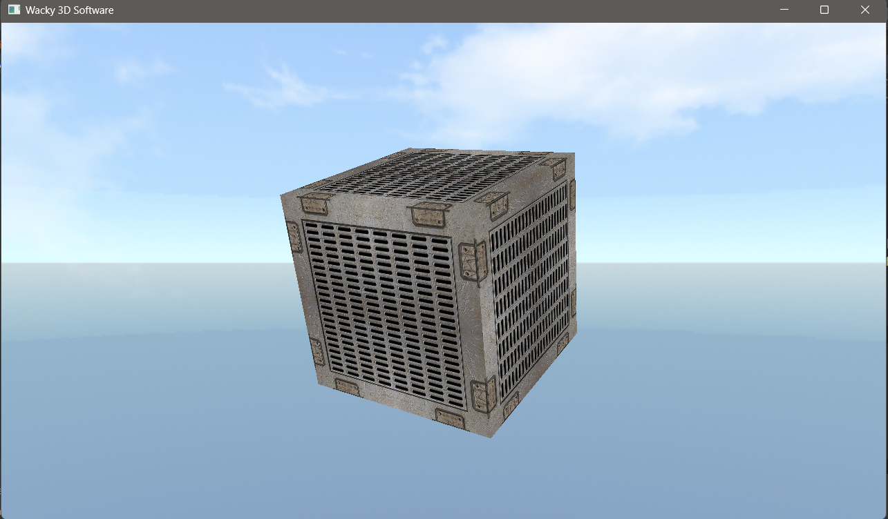

# Wacky_3D_Renderer

Welcome to **Wacky 3D Renderer**, a basic yet functional 3D renderer created using C++ and OpenGL. This project features a rotating textured cube, a skybox, and simple camera controls.

## Features

- **Textured Cube**: A simple cube that rotates based on user input.
- **Skybox**: A surrounding skybox to enhance the 3D environment.
- **Camera Controls**: 
  - Rotate the cube: Hold the left mouse button and move the mouse.
  - Rotate the camera: Hold the middle mouse button and move the mouse.

## Controls

- **Rotate Cube**: Left Mouse Button + Mouse Movement
- **Rotate Camera**: Middle Mouse Button + Mouse Movement

## Libraries

All necessary libraries for this project are included in the [Libraries folder](Libraries).

## Screenshot

